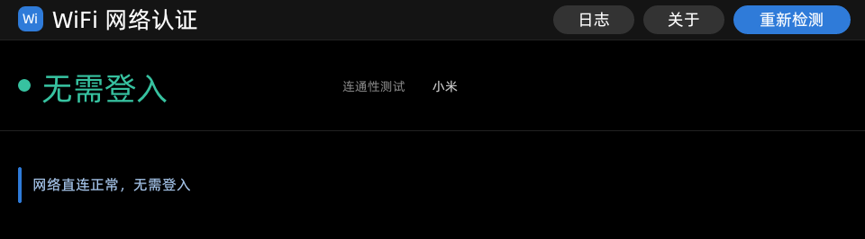
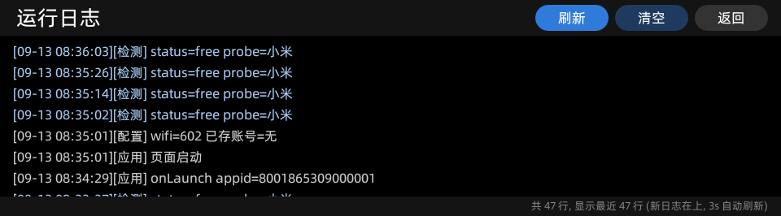
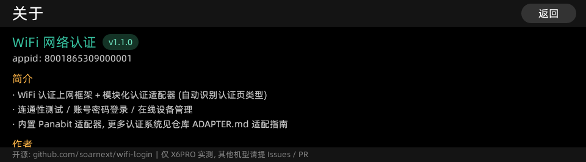
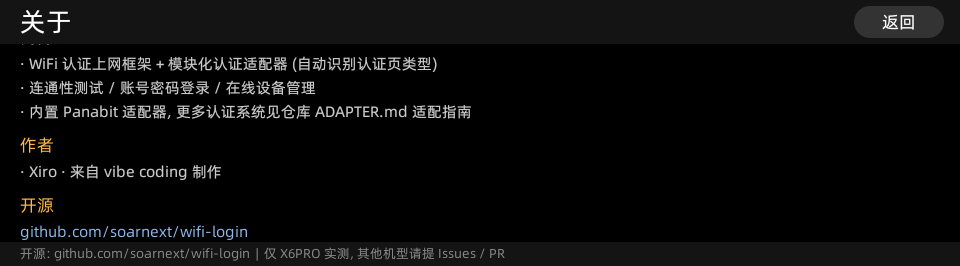

# WiFi 网络认证 (有道词典笔)

面向有道词典笔的 WiFi captive portal 登录应用。本体是一个**认证框架**:
连通性检测、认证页类型自动识别、适配器注册表、UI、账号存储、日志都是通用的;
具体的认证协议 (获取配置 / 登录 / 状态心跳 / 下线 / 设备管理) 由
**可插拔的适配器模块**实现。内置 [Panabit 上网认证系统](docs/panabit-api.md)
适配器作为默认适配器与演示模板, 开发者可按
[适配器开发指南](ADAPTER.md) 适配任意 WiFi 登入页面。

## 目录

- [界面](#界面)
- [功能](#功能)
- [快速开始](#快速开始)
- [文档导航](#文档导航)
- [设备兼容性](#设备兼容性)
- [反馈与贡献](#反馈与贡献)

## 界面

960×266 横条屏, 纯黑主题 (真机 X6PRO 实拍):

| 主页面 (无需登入状态) | 设备日志页 (按 tag 着色) |
|---|---|
|  |  |

| 关于页 | 关于页 (作者 / 开源) |
|---|---|
|  |  |

## 功能

### 认证框架 + 模块化适配器

本体不依赖任何具体认证协议, 协议实现在 `ui/src/services/portal-adapters/` 下的
适配器模块 (必选接口 `match` / `loadConf` / `login`, 可选 `queryStat` / `logout` /
`sync` / `listDevices` / `offOne` / `offAll`); 协议语义 (会话刷新 / 失败重试 /
返回码文案) 全部收口在适配器内, 页面不出现协议分支。
适配器提供 `listDevices` 才会在界面显示「设备管理」入口。

### 认证页类型自动识别

检测到被强制门户拦截后, 每个适配器按页面特征 (跳转 URL 参数 / 页面标题 /
内容 / 响应头) 评分, 取最高分者; 识别不出时回退该 WiFi 上次成功登录所用的
适配器, 再不行界面显示「认证类型」选择行由用户手选 (选完还可手动输入服务器地址)。
登录成功会把所用适配器按 WiFi 记住, 下次同 WiFi 优先复用。

### 连通性测试 (国内探测源)

小米 `connect.rom.miui.com/generate_204`、vivo `wifi.vivo.com.cn/generate_204`、
华为 `connectivitycheck.platform.hicloud.com/generate_204`。

- **并发竞速**: 三个探测源同时发起, 首个给出确定结论的直接采纳, 不再逐个串行等待
  (实测正常网络下从 ~240ms+ 降到 ~35ms 量级); 单源失败不判决, 全部失败才判无网络
- 网络直连正常 → 提示 **"无需登入"**; 若已认证则**自动进入设备管理页**
- 被强制门户劫持 → 解析跳转页面 (302 Location 透传 / meta refresh / location.href /
  带 `wlanuserip`、`paip` 参数的链接), 展示 **Portal 服务器 IP:端口** 与跳转页面 URL
- 全部探测失败 → 提示无网络连接

### 账号密码登录

由认证适配器实现 (内置 Panabit: `webauth/user_login`, 密码 AES-128-ECB/ZeroPadding
加密, 密钥 `Panabit@1024_key`, 与网页端 `pa_aes_encode` 一致; 登录前自动刷新会话,
会话过期类失败自动重试一次, 语义在适配器内自理)。

### 设备管理页 (`management`)

由适配器提供 `listDevices` / `offOne` / `offAll` 能力 (Panabit 适配器实现):

- **在线设备列表** (`ucenter/load_user_list`): 设备名 / 在线 IP / MAC / 在线时长, 自动标记「本机」
- **单设备下线** (`ucenter/user_offone`, `addr=<ip>`): 每台设备一个下线按钮, 带确认弹层
- **全部下线** (`ucenter/user_offall`): 下线后自动返回主页重新检测
- 列表 15 秒自动刷新; 全部下线/确认等用自绘弹层 (原生 confirmDialog 不适配横条屏)

### 已认证即进管理页

启动检测、登录成功复查、MAC 免认证 (`code=200`) 判定为已认证时, 自动跳转设备管理页
(停留 800ms 让用户看到状态); 外部小程序调用 (`action=check|login`) 与用户手动点
「重新检测」时不自动跳转, 避免打断调用方流程或界面自己跳走。

- **防空转**: 自动进入次数上限 2 次, 服务器连不上时不再反复来回跳; 管理页成功拉到
  设备列表后通过 `wifiManageUsable` 事件重置计数。
- **管理页兜底退出**: 网络类失败 (`connect failed` / `timeout`) 连续 2 次自动退回主页,
  并通过 `wifiManageClosed` 事件通知主页 (只在真正关闭时才触发返回重检, 管理页在前台
  时不会误判为"已返回")。

### 记住密码 (按 WiFi 隔离)

文件落盘 (`$dataDir/wifi_account.json`), 密码 AES 密文存储。

- **每个 WiFi 各存各的账号**: 存储结构 `{ version:2, accounts:{ "<ssid>": {...} }, ssid }`
  (槽位含上次成功登录所用 `adapter`), 换到别的网络不会用上一个网络的账号密码;
  当前 WiFi 名称由原生 `panet.wifiSsid()` 读取 (`iw dev <if> link` → `wpa_cli status` 兜底);
- **密码不显明文**: 已记住的密码只显示固定长度圆点掩码, 新输入的密码明文显示 3 秒便于核对;
- 取不到 WiFi 名称时回退"最近使用"槽位; v1 旧数据自动迁移;
- 支持一键下线 (`ucenter/user_offall`)。

### 会话过期自动处理

网页认证页靠 5 秒一次的 `query_auth_stat` 心跳维持服务器侧会话, 页面静止几分钟后
token 过期会提示"无法登入需刷新"。本应用:

1. 每次登录前自动重新 `load_portal_conf` 刷新会话 (等价网页端刷新页面);
2. 认证页停留期间 30 秒心跳保活, 同时探测是否已在别处完成认证;
3. 会话过期类失败自动刷新重试一次 (密码错误 255 / 锁定 3 / 需改密 2 不重试);
4. 切后台超过 90 秒回前台自动重新检测; 从管理页返回时立即重新检测本机状态。

### 前后台切换不冲突

- 每次重新检测会 `abort` 上一次仍在途的探测, 迟到的旧结果不再覆盖新状态;
- 系统输入法面板引起的 onHide/onShow 被识别并抑制, 不会冲掉登录表单;
- 检测/心跳/日志等定时器在 onHide/onUnload 统一释放。

### 系统输入法

账号/密码通过 `global.startTextEdit` 唤起系统级"有道输入法"面板
(单例 Global、textEditFinished on/off 成对、UUID 校验、仅 editConfirmed 写回、页面销毁清理)。

## 快速开始

从 [Releases](https://github.com/soarnext/wifi-login/releases) 下载**对应平台**的 AMR
(`-rk` 给 RK3562 机型 / `-cvi` 给 CVITEK 机型), 安装:

```sh
# RK3562 (X6PRO)
adb push 8001865309000001.1_1_2-rk.amr /data/local/tmp/
adb shell "miniapp_cli install /data/local/tmp/8001865309000001.1_1_2-rk.amr"
adb shell "miniapp_cli start 8001865309000001"

# CVITEK (RISC-V 机型): 换用 -cvi 后缀的产物
```

> 该固件 `miniapp_cli start <appid>` 不带 `--page` 才进主页。
> 推送 `main` 或打 `v*` 标签会触发 GitHub Actions 自动构建**两个平台**的产物并发布 Release。

## 文档导航

| 文档 | 内容 |
|---|---|
| [ADAPTER.md](ADAPTER.md) | 适配器模块开发指南: 接口契约 + 各平台提取页面源码 + 全流程 |
| [SKILL.md](SKILL.md) | 配套 skill: 从网站分析到制作适配器的完整流程要求 |
| [docs/external-api.md](docs/external-api.md) | 外部小程序调用接口、设备管理页拉起、status.json、日志 |
| [docs/panabit-api.md](docs/panabit-api.md) | Panabit Portal API (端点/参数/返回码/密码加密) |
| [docs/project.md](docs/project.md) | 工程结构、构建 (CI 与本地)、版本与产物命名 |
| [CHANGELOG.md](CHANGELOG.md) | 更新日志 (CI 发版时按版本抽取为 Release Notes) |

## 设备兼容性与平台

本应用支持两个硬件平台, **页面/UI/适配器代码完全一致**, 差异全部收在
`ui/src/services/platform/` 平台实现层; CI 为两个平台分别构建产物并区分命名。

| 平台 | 机型 | 状态 | Release 产物 |
| --- | --- | --- | --- |
| **RK3562** (ARM / aarch64) | 有道词典笔 X6PRO | ✅ 已实测 | `<appid>.<版本>-rk.amr` |
| **CVITEK** (RISC-V C906) | 搭载 CVI 芯片的机型 (如词典笔 X7PRO 等) | ⚠️ 代码就绪, **待真机验证** | `<appid>.<版本>-cvi.amr` |

平台差异对照:

| 能力 | RK 版 | CVI 版 |
| --- | --- | --- |
| 网络请求 | 自研 `panet` 原生库 (随包打进 `.so`) | 固件原生 `$jsapi/http` 模块 |
| 账号存储 | 文件 `$dataDir/wifi_account.json` | 原生 `$jsapi/system_kv` 键值存储 |
| 运行日志 | 落盘 `/userdisk/xiro/wifi.log` | 内存缓冲 (应用内日志页可看, 重启清空) |
| 状态写盘 | `/userdisk/xiro/status.json` | 无文件模块, 跳过 |
| WiFi 名称 (按网隔离存储) | 原生 `panet.wifiSsid()` | 无对应 API, 回退"最近使用"槽位 |
| 页面 / 适配器 / 输入法 | 同一套代码 | 同一套代码 |

CVI 适配依据官方引擎库 [yocop/iot_miniapp_sdk](https://gitee.com/yocop/iot_miniapp_sdk)
（RISC-V C906 平台, 与 RK 版同为 Falcon 引擎）分析实现, 尚无真机验证;
CVI 机型用户请下载 `-cvi` 后缀产物, 遇到问题附机型与日志提 Issue。

本应用依赖固件私有能力 (原生 JSAPI、系统输入法 `global.startTextEdit`、960×266 横条屏布局),
不同机型/固件版本之间可能存在差异。

## 反馈与贡献

- **提 Issue**: [Bug 反馈 / 添加认证适配器 模板](https://github.com/soarnext/wifi-login/issues/new/choose)
  —— Bug 请附机型/版本/复现步骤/日志 (`/userdisk/xiro/wifi.log`)/截图;
  适配新认证系统请按 [ADAPTER.md](ADAPTER.md) 步骤 1 提取登录页与管理页全部源码后提交。
- **Pull Request**: 欢迎 Fork 后提交, 合并前提:
  1. **不得影响 X6PRO 上已验证的现有功能** —— 这是唯一的基准机型
  2. 机型差异请用能力探测做分支处理 (例如 `panet` 方法是否存在、屏幕尺寸、
     jsapi 可用性), 不要直接改掉通用逻辑
  3. 涉及屏幕尺寸的改动必须同时适配 960×266
